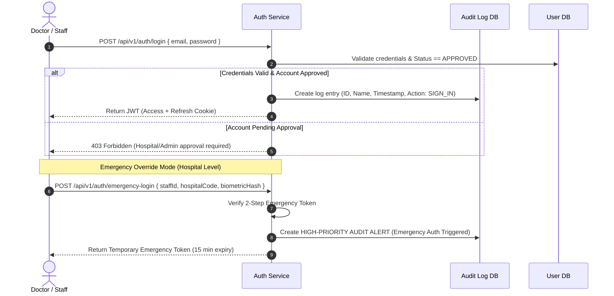
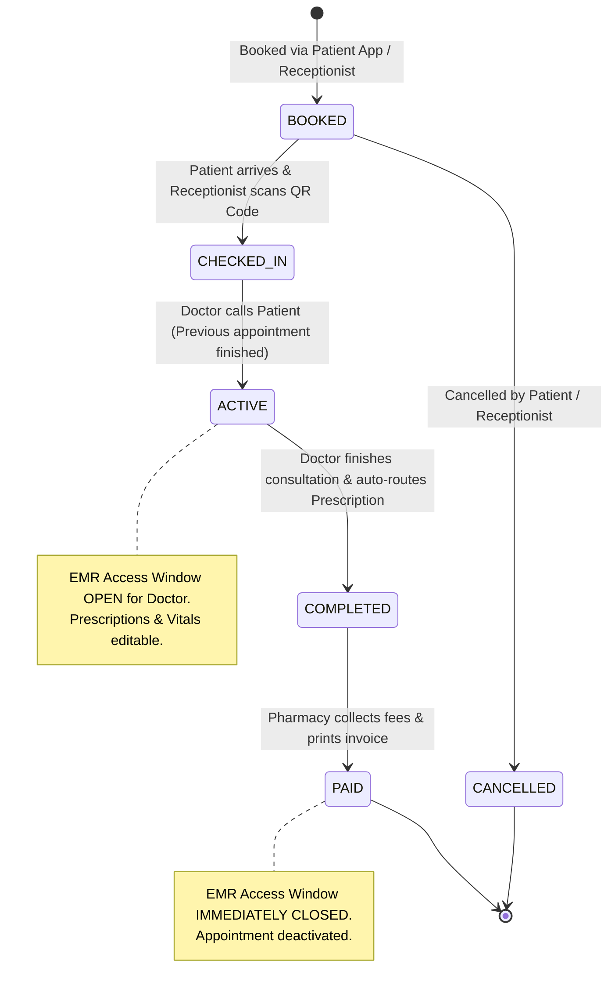
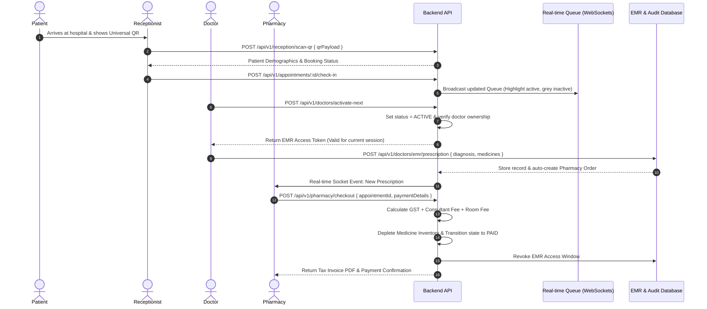

# Hospital Management Platform - System Architecture & Design Document

> **Platform Tech Stack:** React, Node.js (Express), MongoDB (Mongoose), JWT Auth, Tailwind CSS, WebSockets / Socket.io  
> **Document Version:** 1.0.0  
> **Status:** Production-Ready Specification  

---

## 1. Executive Summary & Multi-Tenant Architecture

The Hospital Management Platform is a scalable, multi-tenant enterprise solution designed to seamlessly connect System Administrators, Hospital Administrators, Doctors, Receptionists, Patients, and Pharmacy/Billing Staff.

```
                  +-------------------------------------------------------+
                  |               SYSTEM ADMIN CONSOLE                   |
                  |  (Hospital Onboarding, Platform-wide Analytics)       |
                  +--------------------------+----------------------------+
                                             |
                                  Approve & Onboard
                                             v
        +------------------------------------+------------------------------------+
        |                                                                         |
        v                                                                         v
+-------------------------------+                               +-------------------------------+
|       HOSPITAL A TENANT       |                               |       HOSPITAL B TENANT       |
|  (Doctors, Staff, Inventory)  |                               |  (Doctors, Staff, Inventory)  |
+---------------+---------------+                               +---------------+---------------+
                |                                                               |
                +-------------------------------+-------------------------------+
                                                |
                                                v
                              +----------------------------------+
                              |   UNIVERSAL PATIENT ID & EMR     |
                              |   (Cross-Hospital QR Passport)   |
                              +----------------------------------+
```

### Key Multi-Tenant Principles
1. **Tenant Isolation:** Data across hospitals is isolated via `hospitalId` indexing at the MongoDB collection level, while maintaining a unified Patient ID namespace for cross-hospital portability.
2. **Dual-Verification Onboarding:** High-privilege access and hospital tenant creation require two independent verification steps (Hospital Registration + System Admin Validation).
3. **Time-Bounded EMR Access Window:** Patient Electronic Medical Records (EMR) are only accessible to assigned doctors when an appointment state is explicitly `ACTIVE`. Post-payment deactivation immediately locks EMR access.
4. **Audit Logging:** Every login, logout, emergency override, and EMR access event is immutably logged with timestamp, user ID, role, and client metadata.

---

## 2. System Role & Access Control Matrix

| Role | Auth Method | Tenant Scope | Key Capabilities & Limitations |
| :--- | :--- | :--- | :--- |
| **System Admin** | 2FA + JWT | Platform-wide | Onboards/approves hospitals, views total platform metrics, manages system config. *No EMR access.* |
| **Hospital Admin**| Dual Verified JWT | Single Hospital | Manages doctor/staff DB, monitors room/O2 inventory, views hospital analytics. *No EMR access.* |
| **Doctor** | Verified JWT + Audit Log | Assigned Hospital | Views active queue, writes EMR/prescriptions during `ACTIVE` appointment. *EMR locked when inactive.* |
| **Receptionist** | Verified JWT | Assigned Hospital | Registers patients, generates/scans QR, manages check-ins, room allocation, triggers appointment activation. |
| **Patient** | OTP / Password JWT | Cross-Hospital | Views medical history, manages data access requests, books appointments, presents Universal QR code. |
| **Pharmacy / Billing**| Verified JWT | Assigned Hospital | Processes prescriptions, collects payments (GST + Consultant + Room fees), triggers post-payment deactivation. |

---

## 3. Module Workflows & Architecture Diagrams

### 3.1 Authentication & Emergency Access Workflow


---

### 3.2 Patient Check-In & Appointment Queue State Machine



---

### 3.3 End-to-End Clinical & Pharmacy Data Flow



---

## 4. Complete Database Schema Specification (MongoDB / Mongoose)

### 4.1 `Hospitals` Collection
```typescript
interface IHospital {
  _id: mongoose.Types.ObjectId;
  hospitalCode: string; // Unique string identifier e.g., "HOSP-NYC-001"
  name: string;
  address: {
    street: string;
    city: string;
    state: string;
    zipCode: string;
  };
  contactEmail: string;
  contactPhone: string;
  verificationStatus: 'PENDING_HOSPITAL' | 'PENDING_ADMIN' | 'APPROVED' | 'REJECTED';
  dualVerification: {
    hospitalVerifiedAt?: Date;
    adminVerifiedAt?: Date;
    adminVerifiedBy?: mongoose.Types.ObjectId; // SystemAdmin ID
  };
  consultantFeeStructure: {
    generalPhysician: number;
    specialist: number;
    superSpecialist: number;
  };
  createdAt: Date;
  updatedAt: Date;
}
```

### 4.2 `Users` Collection (Multi-Role Super-Entity)
```typescript
interface IUser {
  _id: mongoose.Types.ObjectId;
  universalPatientId?: string; // e.g. "UPID-8849-2026", populated for patients
  hospitalId?: mongoose.Types.ObjectId; // Ref: Hospitals (null for SystemAdmin)
  fullName: string;
  email: string;
  passwordHash: string;
  phone: string;
  role: 'SYSTEM_ADMIN' | 'HOSPITAL_ADMIN' | 'DOCTOR' | 'RECEPTIONIST' | 'PATIENT' | 'PHARMACY';
  approvalStatus: 'PENDING' | 'APPROVED' | 'SUSPENDED';
  doctorDetails?: {
    specialization: string;
    licenseNumber: string;
    consultationFee: number;
    roomNo: string;
    isAvailable: boolean;
  };
  qrCodePayload?: string; // Encypted string for Patient QR
  createdAt: Date;
  updatedAt: Date;
}
// Indexes: { email: 1, unique: true }, { universalPatientId: 1 }, { hospitalId: 1, role: 1 }
```

### 4.3 `StaffLogs` Collection (Audit Trail)
```typescript
interface IStaffLog {
  _id: mongoose.Types.ObjectId;
  hospitalId: mongoose.Types.ObjectId;
  userId: mongoose.Types.ObjectId;
  userName: string;
  userRole: string;
  action: 'SIGN_IN' | 'SIGN_OUT' | 'EMERGENCY_ACCESS' | 'EMR_ACCESS_DENIED';
  ipAddress: string;
  userAgent: string;
  timestamp: Date;
}
// Indexes: { hospitalId: 1, timestamp: -1 }, { userId: 1 }
```

### 4.4 `Appointments` Collection
```typescript
interface IAppointment {
  _id: mongoose.Types.ObjectId;
  appointmentNumber: string; // e.g. "APT-20260802-0042"
  hospitalId: mongoose.Types.ObjectId;
  patientId: mongoose.Types.ObjectId;
  doctorId: mongoose.Types.ObjectId;
  queuePosition: number;
  status: 'BOOKED' | 'CHECKED_IN' | 'ACTIVE' | 'COMPLETED' | 'PAID' | 'CANCELLED';
  activeWindowStartedAt?: Date;
  activeWindowEndedAt?: Date;
  bookingChannel: 'PATIENT_APP' | 'RECEPTION_DESK';
  roomAllocated?: {
    roomId: mongoose.Types.ObjectId;
    roomNumber: string;
    allocatedAt: Date;
  };
  createdAt: Date;
  updatedAt: Date;
}
// Indexes: { doctorId: 1, status: 1, queuePosition: 1 }, { hospitalId: 1, createdAt: -1 }
```

### 4.5 `EMRRecords` & `Prescriptions` Collections
```typescript
interface IEMRRecord {
  _id: mongoose.Types.ObjectId;
  patientId: mongoose.Types.ObjectId;
  hospitalId: mongoose.Types.ObjectId;
  appointmentId: mongoose.Types.ObjectId;
  doctorId: mongoose.Types.ObjectId;
  vitals: {
    bloodPressure: string;
    heartRate: number;
    temperatureCelsius: number;
    spO2Percentage: number;
  };
  symptoms: string[];
  diagnosis: string;
  doctorNotes: string;
  isAccessible: boolean; // Computed or checked against appointment status === 'ACTIVE'
  createdAt: Date;
}

interface IPrescriptionItem {
  medicineId: mongoose.Types.ObjectId;
  medicineName: string;
  dosage: string; // e.g., "500mg"
  frequency: string; // e.g., "1-0-1 (After Meals)"
  durationDays: number;
  quantityRequired: number;
  unitPrice: number;
}

interface IPrescription {
  _id: mongoose.Types.ObjectId;
  appointmentId: mongoose.Types.ObjectId;
  patientId: mongoose.Types.ObjectId;
  doctorId: mongoose.Types.ObjectId;
  hospitalId: mongoose.Types.ObjectId;
  items: IPrescriptionItem[];
  dispenseStatus: 'PENDING' | 'DISPENSED';
  createdAt: Date;
}
```

### 4.6 `InventoryRooms`, `InventoryMachinery` & `PharmacyInventory`
```typescript
interface IInventoryRoom {
  _id: mongoose.Types.ObjectId;
  hospitalId: mongoose.Types.ObjectId;
  roomNumber: string;
  roomType: 'GENERAL_WARD' | 'SEMI_PRIVATE' | 'DELUXE_ICU';
  dailyRate: number;
  isOccupied: boolean;
  currentPatientId?: mongoose.Types.ObjectId;
  occupiedAt?: Date;
  estimatedDischargeDate?: Date;
}

interface IInventoryMachinery {
  _id: mongoose.Types.ObjectId;
  hospitalId: mongoose.Types.ObjectId;
  equipmentType: 'OXYGEN_CYLINDER' | 'VENTILATOR' | 'ECG_MONITOR' | 'DEFIBRILLATOR';
  serialNumber: string;
  status: 'AVAILABLE' | 'IN_USE' | 'MAINTENANCE';
  assignedRoomId?: mongoose.Types.ObjectId;
  hourlyRate: number;
}

interface IPharmacyItem {
  _id: mongoose.Types.ObjectId;
  hospitalId: mongoose.Types.ObjectId;
  name: string;
  genericName: string;
  batchNumber: string;
  stockQuantity: number;
  reorderLevel: number;
  unitPrice: number;
  gstRatePercentage: number; // e.g., 5, 12, or 18
  expiryDate: Date;
}
```

### 4.7 `Invoices` Collection
```typescript
interface IInvoice {
  _id: mongoose.Types.ObjectId;
  invoiceNumber: string; // e.g., "INV-2026-9901"
  appointmentId: mongoose.Types.ObjectId;
  patientId: mongoose.Types.ObjectId;
  hospitalId: mongoose.Types.ObjectId;
  breakdown: {
    consultantFee: number;
    roomChargeTotal: number;
    machineryChargeTotal: number;
    medicineSubtotal: number;
    gstBreakdown: {
      gst5PercentAmount: number;
      gst12PercentAmount: number;
      gst18PercentAmount: number;
      totalGst: number;
    };
    totalAmount: number;
  };
  paymentStatus: 'UNPAID' | 'PAID';
  paymentMethod?: 'CASH' | 'CARD' | 'UPI' | 'INSURANCE';
  paidAt?: Date;
}
```

---

## 5. API Endpoint Specifications

### 5.1 Authentication (`/api/v1/auth`)
* **`POST /api/v1/auth/register`**
  * **Role:** Public (Patient) / Hospital Admin Initialization
  * **Request Body:** `{ fullName, email, password, phone, role, hospitalDetails? }`
  * **Response (201):** `{ message: "Registration submitted. Pending dual approval.", userId: "..." }`
* **`POST /api/v1/auth/login`**
  * **Request Body:** `{ email, password }`
  * **Response (200):** `{ token: "jwt_access_token", user: { id, name, role, hospitalId } }`  
  * **Side-Effect:** Appends entry to `StaffLogs` if role is Doctor/Staff.
* **`POST /api/v1/auth/logout`**
  * **Headers:** `Authorization: Bearer <token>`
  * **Response (200):** `{ message: "Logged out successfully" }`
  * **Side-Effect:** Appends `SIGN_OUT` log in `StaffLogs`.

### 5.2 System Admin Operations (`/api/v1/admin`)
* **`GET /api/v1/admin/hospitals`**
  * **Auth:** System Admin JWT
  * **Response (200):** `{ totalHospitals: 14, pendingApprovals: 3, hospitals: [...] }`
* **`POST /api/v1/admin/hospitals/:id/approve`**
  * **Auth:** System Admin JWT
  * **Request Body:** `{ action: "APPROVE" | "REJECT", comments: string }`
  * **Response (200):** `{ message: "Hospital dual-verification completed.", status: "APPROVED" }`

### 5.3 Hospital & Inventory Operations (`/api/v1/hospitals`)
* **`GET /api/v1/hospitals/dashboard-metrics`**
  * **Auth:** Hospital Admin JWT
  * **Response (200):** 
    ```json
    {
      "totalDoctorCount": 42,
      "totalPatientCount": 1280,
      "roomMetrics": { "totalRooms": 100, "occupiedRooms": 68, "availableRooms": 32 },
      "machineryMetrics": { "totalOxygenCylinders": 50, "availableCylinders": 18 },
      "upcomingDischarges": [
        { "roomNumber": "304B", "patientName": "John Doe", "dischargeDate": "2026-08-03T10:00:00Z" }
      ]
    }
    ```
* **`POST /api/v1/hospitals/doctors`**
  * **Auth:** Hospital Admin JWT
  * **Request Body:** `{ fullName, email, password, specialization, licenseNumber, consultationFee }`

### 5.4 Doctor Operations & EMR Window (`/api/v1/doctors`)
* **`GET /api/v1/doctors/queue`**
  * **Auth:** Doctor JWT
  * **Response (200):** List of appointments assigned to doctor for current day with status highlighted (`ACTIVE` vs `CHECKED_IN` vs `BOOKED`).
* **`POST /api/v1/doctors/appointments/:id/activate`**
  * **Auth:** Doctor JWT
  * **Response (200):** `{ message: "Appointment activated. EMR Access unlocked.", activeAppointmentId: "..." }`
* **`GET /api/v1/doctors/emr/:patientId?appointmentId=...`**
  * **Auth:** Doctor JWT + Middleware Check (`appointmentId.status === 'ACTIVE'`)
  * **Response (200):** Complete EMR history. Returns **403 Forbidden** if appointment is not `ACTIVE`.
* **`POST /api/v1/doctors/prescriptions`**
  * **Auth:** Doctor JWT (Active appointment required)
  * **Request Body:** `{ appointmentId, patientId, diagnosis, notes, items: [...] }`
  * **Response (201):** `{ message: "Prescription recorded and routed to Pharmacy.", prescriptionId: "..." }`

### 5.5 Reception & Patient Flow (`/api/v1/reception`)
* **`POST /api/v1/reception/patients/register`**
  * **Auth:** Receptionist JWT
  * **Response (201):** Returns newly registered patient along with generated `universalPatientId` and encrypted QR payload.
* **`POST /api/v1/reception/scan-qr`**
  * **Request Body:** `{ qrPayload: "ENCRYPTED_STRING" }`
  * **Response (200):** `{ patient: {...}, activeBooking: {...} }`
* **`POST /api/v1/reception/allocate-room`**
  * **Request Body:** `{ patientId, roomId, estimatedDischargeDate }`

### 5.6 Pharmacy & Billing (`/api/v1/pharmacy`)
* **`GET /api/v1/pharmacy/prescriptions/pending`**
  * **Auth:** Pharmacy Staff JWT
  * **Response (200):** Queue of prescriptions automatically delivered from Doctor module.
* **`POST /api/v1/pharmacy/checkout`**
  * **Auth:** Pharmacy Staff JWT
  * **Request Body:** `{ appointmentId, paymentMethod: "CARD" }`
  * **Response (200):** 
    ```json
    {
      "invoiceNumber": "INV-2026-9901",
      "breakdown": {
        "consultantFee": 800.00,
        "roomChargeTotal": 1500.00,
        "medicineSubtotal": 450.00,
        "totalGst": 67.50,
        "totalAmount": 2817.50
      },
      "paymentStatus": "PAID",
      "emrAccessDeactivated": true
    }
    ```

---

## 6. Authentication, Authorization & Security Architecture

### 6.1 Role-Based Access Control (RBAC) & Middleware Implementation
```javascript
// middleware/auth.js
const jwt = require('jsonwebtoken');
const Appointment = require('../models/Appointment');
const StaffLog = require('../models/StaffLog');

// 1. Verify Authentication & Extract Claims
const verifyToken = (req, res, next) => {
  const authHeader = req.headers.authorization;
  if (!authHeader || !authHeader.startsWith('Bearer ')) {
    return res.status(401).json({ error: 'Access denied. Token missing.' });
  }
  const token = authHeader.split(' ')[1];
  try {
    const decoded = jwt.verify(token, process.env.JWT_SECRET);
    req.user = decoded; // { id, role, hospitalId }
    next();
  } catch (err) {
    return res.status(401).json({ error: 'Invalid or expired token.' });
  }
};

// 2. Enforce Authorized Roles
const authorizeRoles = (...allowedRoles) => {
  return (req, res, next) => {
    if (!allowedRoles.includes(req.user.role)) {
      return res.status(403).json({ 
        error: `Role '${req.user.role}' unauthorized for this action.` 
      });
    }
    next();
  };
};

// 3. Dynamic EMR Access Enforcement (Strict Time Window Rule)
const validateActiveEMRAccess = async (req, res, next) => {
  const { appointmentId } = req.query.appointmentId ? req.query : req.body;

  if (!appointmentId) {
    return res.status(400).json({ error: 'Appointment ID required for EMR access validation.' });
  }

  const appointment = await Appointment.findById(appointmentId);
  if (!appointment) {
    return res.status(404).json({ error: 'Appointment record not found.' });
  }

  // Guard: Appointment must be in ACTIVE status
  if (appointment.status !== 'ACTIVE') {
    // Log unauthorized attempt to access EMR
    await StaffLog.create({
      hospitalId: req.user.hospitalId,
      userId: req.user.id,
      userName: req.user.fullName,
      userRole: req.user.role,
      action: 'EMR_ACCESS_DENIED',
      ipAddress: req.ip,
      timestamp: new Date()
    });
    return res.status(403).json({
      error: 'EMR access denied. Appointment is not currently ACTIVE.'
    });
  }

  // Guard: Doctor accessing must be assigned doctor
  if (req.user.role === 'DOCTOR' && appointment.doctorId.toString() !== req.user.id) {
    return res.status(403).json({ error: 'Unauthorized. You are not the assigned doctor.' });
  }

  req.appointment = appointment;
  next();
};

module.exports = { verifyToken, authorizeRoles, validateActiveEMRAccess };
```

---

## 7. Pharmacy & Billing Calculation Engine Logic

The billing module automatically compiles consultant fees, daily/hourly room rates, equipment consumption, and itemized medicine costs with multi-tier GST rates.

```javascript
// utils/billingEngine.js

/**
 * Calculates comprehensive hospital bill & itemized GST breakdown
 */
function calculateInvoice({ consultantFee, roomDays, roomDailyRate, machineryHours, machineryHourlyRate, prescriptionItems }) {
  // 1. Calculate Core Components
  const totalConsultantFee = Number(consultantFee) || 0;
  const totalRoomCharge = (Number(roomDays) || 0) * (Number(roomDailyRate) || 0);
  const totalMachineryCharge = (Number(machineryHours) || 0) * (Number(machineryHourlyRate) || 0);

  // 2. Process Medicine Subtotal & Itemized GST
  let medicineSubtotal = 0;
  let gst5PercentAmount = 0;
  let gst12PercentAmount = 0;
  let gst18PercentAmount = 0;

  prescriptionItems.forEach((item) => {
    const itemTotal = item.unitPrice * item.quantityRequired;
    medicineSubtotal += itemTotal;

    // Apply GST tier
    if (item.gstRatePercentage === 5) {
      gst5PercentAmount += itemTotal * 0.05;
    } else if (item.gstRatePercentage === 12) {
      gst12PercentAmount += itemTotal * 0.12;
    } else if (item.gstRatePercentage === 18) {
      gst18PercentAmount += itemTotal * 0.18;
    }
  });

  // Note: Healthcare services (consultant & room charges) are zero-rated for GST under local regulation
  const totalGst = gst5PercentAmount + gst12PercentAmount + gst18PercentAmount;
  const subtotalBeforeTax = totalConsultantFee + totalRoomCharge + totalMachineryCharge + medicineSubtotal;
  const totalAmount = subtotalBeforeTax + totalGst;

  return {
    consultantFee: totalConsultantFee.toFixed(2),
    roomChargeTotal: totalRoomCharge.toFixed(2),
    machineryChargeTotal: totalMachineryCharge.toFixed(2),
    medicineSubtotal: medicineSubtotal.toFixed(2),
    gstBreakdown: {
      gst5PercentAmount: gst5PercentAmount.toFixed(2),
      gst12PercentAmount: gst12PercentAmount.toFixed(2),
      gst18PercentAmount: gst18PercentAmount.toFixed(2),
      totalGst: totalGst.toFixed(2)
    },
    subtotalBeforeTax: subtotalBeforeTax.toFixed(2),
    totalAmount: totalAmount.toFixed(2)
  };
}

module.exports = { calculateInvoice };
```

---

## 8. Frontend React & Tailwind CSS Component Architecture

### 8.1 Folder Directory Structure
```
src/
├── assets/                  # Icons, logos, vector graphics
├── components/
│   ├── common/              # Navbar, Sidebar, Modal, Badge, Toast, Loader
│   ├── auth/                # DualVerificationGuard, EmergencyLoginForm
│   ├── doctor/              # ActiveQueueList, EMRPrescriptionForm, PatientVitalsCard
│   ├── patient/             # UniversalQRDisplay, AppointmentCard, AccessRequestModal
│   ├── reception/           # QRScannerModal, PatientCheckInModal, RoomAllocator
│   ├── pharmacy/            # StockIndicator, BillingCheckoutModal, InvoicePrintView
│   └── admin/               # HospitalApprovalTable, MetricStatsCard
├── context/
│   ├── AuthContext.jsx      # Holds User Token, Role, & Login/Logout handlers
│   └── RealtimeQueueContext # WebSocket connection for live patient queues
├── hooks/
│   ├── useEMRAccess.js      # Checks active appointment status before fetching
│   └── usePharmacyStock.js  # Real-time stock monitor hook
├── pages/
│   ├── AdminDashboard.jsx
│   ├── HospitalDashboard.jsx
│   ├── DoctorDashboard.jsx
│   ├── PatientDashboard.jsx
│   ├── ReceptionDashboard.jsx
│   └── PharmacyDashboard.jsx
├── services/
│   ├── api.js               # Axios instance with interceptors for JWT
│   └── socket.js            # Socket.io client initialization
├── utils/
│   └── qrCodeGenerator.js   # Generates Universal Patient QR string
└── App.jsx
```

### 8.2 Doctor Queue & Active Highlighting Component Sample (React + Tailwind CSS)

```jsx
// src/components/doctor/ActiveQueueList.jsx
import React from 'react';

export const ActiveQueueList = ({ appointments, onActivateAppointment }) => {
  return (
    <div className="bg-slate-900 text-white rounded-xl p-6 shadow-2xl border border-slate-800">
      <h2 className="text-xl font-bold mb-4 text-emerald-400 flex items-center gap-2">
        <span className="w-3 h-3 rounded-full bg-emerald-500 animate-ping"></span>
        Today's Live Patient Queue
      </h2>

      <div className="space-y-4">
        {appointments.map((apt) => {
          const isActive = apt.status === 'ACTIVE';
          const isCheckedIn = apt.status === 'CHECKED_IN';
          const isFinished = ['COMPLETED', 'PAID'].includes(apt.status);

          return (
            <div
              key={apt._id}
              className={`p-5 rounded-lg border transition-all flex items-center justify-between ${
                isActive
                  ? 'bg-emerald-950/40 border-emerald-500 shadow-lg shadow-emerald-950 ring-2 ring-emerald-500/50 scale-[1.02]'
                  : isFinished
                  ? 'bg-slate-950/40 border-slate-800 opacity-40 grayscale'
                  : 'bg-slate-800/50 border-slate-700 opacity-80'
              }`}
            >
              <div className="flex items-center gap-4">
                <div
                  className={`w-10 h-10 rounded-full flex items-center justify-center font-extrabold ${
                    isActive ? 'bg-emerald-500 text-slate-950' : 'bg-slate-700 text-slate-300'
                  }`}
                >
                  #{apt.queuePosition}
                </div>
                <div>
                  <h3 className="font-semibold text-lg text-slate-100">{apt.patientName}</h3>
                  <p className="text-xs text-slate-400">UPID: {apt.universalPatientId} | Age: {apt.patientAge}</p>
                </div>
              </div>

              <div className="flex items-center gap-3">
                {/* Status Badges */}
                <span
                  className={`px-3 py-1 rounded-full text-xs font-semibold uppercase tracking-wider ${
                    isActive
                      ? 'bg-emerald-500/20 text-emerald-300 border border-emerald-500/30'
                      : isCheckedIn
                      ? 'bg-amber-500/20 text-amber-300 border border-amber-500/30'
                      : 'bg-slate-700 text-slate-400'
                  }`}
                >
                  {apt.status}
                </span>

                {/* EMR Access Trigger */}
                {isCheckedIn && (
                  <button
                    onClick={() => onActivateAppointment(apt._id)}
                    className="bg-emerald-600 hover:bg-emerald-500 text-white px-4 py-2 rounded-lg font-medium text-sm transition-colors shadow-md shadow-emerald-900/50"
                  >
                    Start Consultation & Unlock EMR
                  </button>
                )}

                {isActive && (
                  <span className="text-xs font-mono text-emerald-400 bg-emerald-950 px-2 py-1 rounded border border-emerald-800 animate-pulse">
                    EMR Window Unlocked
                  </span>
                )}
              </div>
            </div>
          );
        })}
      </div>
    </div>
  );
};
```

---

## 9. Implementation Roadmap & Checklist

Developers preparing to build this platform should follow this sequential execution path:

- [x] **Phase 1: Foundation & Data Modeling**  
  Initialize Express server, establish MongoDB connections, define Mongoose Schemas (Hospitals, Users, StaffLogs, Appointments, EMR, Inventory, Invoices).
- [ ] **Phase 2: Authentication & RBAC Engine**  
  Implement JWT authentication, password hashing (bcrypt), dual-verification middleware, and immutable audit logger for sign-in/sign-out events.
- [ ] **Phase 3: Receptionist & Patient Universal QR Gateway**  
  Build QR code generation/encryption logic, patient check-in API, and real-time Socket.io queue event broadcaster.
- [ ] **Phase 4: Clinical EMR Access Window**  
  Develop doctor appointment activation state handler and enforce strict middleware restricting EMR access to `status === 'ACTIVE'`.
- [ ] **Phase 5: Pharmacy Inventory & Billing Calculation Engine**  
  Implement medicine auto-routing from doctors, inventory auto-depletion, GST calculation utility, and post-payment appointment deactivation trigger.
- [ ] **Phase 6: React Frontend Integration**  
  Assemble Tailwind CSS UI components, integrate TanStack Query / React Context for state management, and test role-based view permissions.
